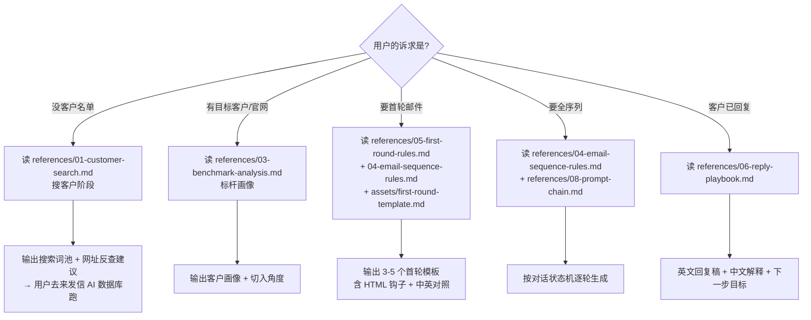

<!-- 版本 / author / license 等字段未在 Claude Code skill 官方 frontmatter reference 中列出,移到 README.md 维护 -->

## 这个 skill 是什么 / 不是什么(请先读)

| ✅ 这个 skill **是** | ❌ 这个 skill **不是** |
|---|---|
| AI 军师 + 文档生成器 — 出搜索词 / 客户画像 / 邮件模板 / 跟进计划配置清单 / 回复脚本 | 端到端 agent — 不会自动登录 / 点击 / 录入来发信网页 |
| 配合来发信(`web.laifaxin.com`)使用的 SOP 包 | 来发信的替代品 |
| 知识库:9 篇 references + 6 个 assets + 5 段工作流 | 浏览器自动化 / 客户邮箱代收发系统 |
| 你拿 skill 输出去**在来发信网页上手动配置**(模板录入 / 计划激活 / 加客户) | 客户回信代理 — 客户回信后 skill 帮你写回复,但**点发送的是你** |

**为什么这样设计**:来发信是纯 web 应用,无对外 API。skill 在两端做事(打前给指令 / 打后吃回信),中间网页操作是用户手动。这是当前来发信架构的真实边界。


# Laifaxin Outreach Skill

> 外贸主动开发 + 来发信跟进计划 一体化 skill · 不只是写邮件,而是覆盖 **搜客户 → 分析客户 → 写首轮 → 排序列 → 推回复** 完整链路。

## 何时触发本 skill

只要用户说类似:
- "用来发信搜 X 外贸客户" / "帮我找 X 的海外买家"
- "根据客户网站 X 写一封开发信"
- "生成来发信智能跟进计划的邮件模板"
- "写第一轮 / 第二轮 / 第三轮外贸开发信"
- "客户回复了 Y,接下来怎么推进 / 怎么报价 / 怎么处理样品费异议"
- "把我的公司资料 + 标杆客户资料转成开发信序列"

## 主流程(5 段分诊)



## 执行约束:产品级硬规则 vs 写作策略默认值

> ⚠️ **重要区分**:下面有些是来发信**产品级硬规则**(违反 = 跑不通 / 客户行动失败),有些是本 skill 内置的**写作策略默认值**(可被用户偏好或行业反例覆盖)。

### A · 产品级硬规则(违反 = 跑不通)

1. **变量必须用【插入变量】按钮替换**:邮件正文里 `{联系人:名称}` / `{姓氏}` / `{First Name}` 等是 **skill 输出的占位示例**,不是来发信真实变量字符串。**录入来发信模板后必须用编辑器顶部【插入变量】按钮重新选择变量**,否则会作为字面字符串发出去 → 客户收到 `Hi {联系人:名称}` 完蛋。出处:[laifa.xin/zhinan/email-templates](https://www.laifa.xin/zhinan/email-templates) L63 "**必用【变量】按钮**插入,别手打,防拼写错"。详见 `references/09-validation.md`。
2. **群发前必须自发测试**:输出 N 个模板后,用户必须在来发信 web 上**给自己邮箱发一封**,确认变量替换正确 + 渲染对再批量发。出处:同上 L68。
3. **搜客户时守黄金原则**:搜**客户产品词**找金主,搜**自己服务词**只找同行。出处:[laifa.xin/zhinan/refine-search-all](https://www.laifa.xin/zhinan/refine-search-all) L170-173。
4. **完整性铁律**:用户指定 N 轮 × M 模板时,要逐封完整生成,严禁"...后续遵循此结构..."省略(这是模型纪律,非产品规则,但同等强制)。

### B · 写作策略默认值(可微调,但默认守)

5. **不要一次性出 30+ 封邮件**:按 `references/08-prompt-chain.md` 推荐对话策略 — 先出第一轮,用户说"继续"再出下一轮。
6. **首轮 ≤ 100 英文词**(含签名):这是高回复率冷邮件方法论的默认值,非来发信产品事实。详见 `references/05-first-round-rules.md`。某些高客单 B2B / 关系销售可能反而需要更长。
7. **避免 `Dear Sir/Madam`**:用 `Hi {联系人:名称}`(⚠️ `{联系人:名称}` 是占位示例 · 录入来发信时必用编辑器顶部【插入变量】按钮替换 · 详见 `references/09-validation.md` 关 2)/ `Hello` / 强开场。某些拉美 / 中东客群可能仍偏好正式称呼,可定制。
8. **正文签名极简(只英文名)** vs **系统发件昵称(`Name from Company`)** 是两件事:
   - 正文签名(邮件最后那行)→ 只留 `Alex` 一类英文名,零营销感
   - 来发信"高级规则 → 发信昵称"→ 应写**真实身份** `Alex from NoodleHouse`(出处:[laifa.xin/zhinan/email-sequence-guide](https://www.laifa.xin/zhinan/email-sequence-guide) L257-260)
9. **CTA 钩子默认 HTML 黄底红字**:`<span style='background-color:yellow; color:red; padding:2px 4px; font-weight:bold;'>KEYWORD</span>`。**Gmail Webmail 已验证可渲染**(出处:[Gmail CSS support](https://developers.google.com/workspace/gmail/design/css))。Outlook.com / Apple Mail / 部分企业邮 fallback 见 `references/04-email-sequence-rules.md § 3`。
10. **输出适合录入来发信**:模板含 主题 / HTML 正文 / 中文对照三段。详见 `references/07-laifaxin-plan-setup.md`。

## 最小输入 schema

按 `assets/company-profile-template.md` + `assets/benchmark-customer-template.md` 收集:

```yaml
company_profile:
  company_name: 必填
  website: 必填
  founded_year: 推荐
  factory_size: 推荐
  core_products: 必填
  certifications: 推荐
  export_markets: 推荐
  strengths: 必填

target_market:
  country: 必填
  customer_type: 必填(如 wholesaler / distributor / retailer)
  target_roles: 推荐(采购经理 / 品类总监)
  pain_points: 必填(用户视角的痛点)

benchmarks:                   # 1-2 个标杆客户的 about 页文本或网址
  - website:
    about_text:

sequence_request:
  total_rounds: 可选(默认 6-12 由 skill 拍)
  templates_per_round: 可选(默认 3-6 由 skill 拍)
  tone: 可选(专业直接 / 热情友好 / 高端专属 / 风趣创意)
  output_language: 可选(默认 en + cn 对照)
```

## references 索引

| 文件 | 用途 |
|---|---|
| `references/00-workflow-overview.md` | 整套工作流(必读)|
| `references/01-customer-search.md` | 搜客户:三种搜法 + 中英类型词扩展 + 网址反查 |
| `references/02-company-profile-schema.md` | 公司资料字段化 |
| `references/03-benchmark-analysis.md` | 标杆客户画像提取(含**零标杆 fallback 模式**) |
| `references/04-email-sequence-rules.md` | 邮件写作 SOP 默认值(呼吸感公式 / 视觉焦点层级 / 钩子 3 原型 + Gmail fallback / 9 策略 / 极简)|
| `references/05-first-round-rules.md` | 首轮邮件专属规则(100 词 / 短 / 拿回复) · **首轮规则优先级 > 04** |
| `references/06-reply-playbook.md` | 回复推进 SOP(非负责人转介 / 竞品对比 / 样品费异议 / 试订单)|
| `references/07-laifaxin-plan-setup.md` | 来发信端操作约束(模板目录 / 轮次间隔 / 高级规则)|
| `references/08-prompt-chain.md` | 推荐对话策略 + interrupt handlers(不是确定性状态机)|
| `references/09-validation.md` | **必读** · 装好后 5 分钟验收(触发 / 变量 / 预览 / 自发测试)|

## assets 索引

| 文件 | 用途 |
|---|---|
| `assets/company-profile-template.md` | 用户填表收集公司资料 |
| `assets/benchmark-customer-template.md` | 用户填表收集 1-2 个标杆客户 |
| `assets/search-keywords-food-example.csv` | 搜索词池**示例**(中英对照,亚洲食品案例 · 非通用模板) · 其他行业(CNC/LED/化工)用户照结构改 |
| `assets/first-round-template.md` | 真实首轮邮件样例(参 Noodle House 案例)|
| `assets/followup-round-template.md` | 多轮序列模板(主题 / 正文 / 策略意图 / 中文说明)|
| `assets/reply-recipe-template.md` | 回复场景应对脚本 |

## 与本仓库其他 skill 的关系

本 skill 是 **对外发布版**。本地仓库还有几个**内部 vault skill**(用于在 laifaxin-docs 项目内辅助 Tony 写文档):

- `skills/laifa-audience-research.md` — 本地军师 + AI 二次判断 + 历史档案
- `skills/laifa-sequence-plan.md` — 本地跟进计划设计
- `skills/laifa-debrief.md` — 本地复盘回填

两者**互补不冲突**:本地 vault 版用于 Tony 自己运营时沉淀客群知识,公开包用于客户安装到自己环境跑开发信生成。

## 防 hallucination · 两层引用源

### 第一层 · 来发信产品级事实

涉及功能 / 入口 / 字段 / 数字的论断,**必须**指向现行权威源(已避开已下线 / 已合并旧页):

- AI 数据库 + AI 推演 + 提纯搜 + 找相似:[laifa.xin/zhinan/refine-search-all](https://www.laifa.xin/zhinan/refine-search-all)
- AI 评分 6 大维度 + 60+ 阈值:[laifa.xin/zhinan/ai-rating-guide](https://www.laifa.xin/zhinan/ai-rating-guide)
- 智能跟进计划 + 高级规则 7 项:[laifa.xin/zhinan/email-sequence-guide](https://www.laifa.xin/zhinan/email-sequence-guide)
- 邮件模板 + 变量插入 + 自发测试:[laifa.xin/zhinan/email-templates](https://www.laifa.xin/zhinan/email-templates)
- 新手 10 分钟主线:[laifa.xin/zhinan/quick-start-laifaxin-10min](https://www.laifa.xin/zhinan/quick-start-laifaxin-10min)

**禁引**:`precise-buyer-search.md`(功能已并入 AI 数据库)/ `ai-customer-screening-guide.md`(已升级为 AI 评分)等顶部带 `:::warning 下线 / 已合并 / 待更新` 标记的页面。

### 第二层 · 写作策略默认值(非产品事实)

下列规则源自外贸冷邮件方法论 / 本 skill 内置启发,**不是**来发信产品规定,可被用户偏好或行业反例覆盖,**不要包装成"产品事实"**:

- 首轮 ≤ 100 词
- 黄底红字钩子 span
- 严禁 `Dear Sir/Madam`
- 9 策略编号 + 3 钩子原型矩阵

## 旧名映射 · 当用户用旧称呼时

来发信经历过功能改名,老用户 / 老教程里常见旧名。skill 应识别并映射:

| 旧名 | 现称 |
|---|---|
| 精准买家搜索 / Precise Buyer Search | AI 数据库 + AI 推演 |
| 全球搜客引擎 / 企业数据库 | AI 数据库 |
| AI 客户筛选 / AI Screening | AI 评分 |
| 邮件序列 / Sequence / Sequences | 智能跟进计划 |

出处:[email-sequence-guide L506-508](https://www.laifa.xin/zhinan/email-sequence-guide) 官方旧名说明。
