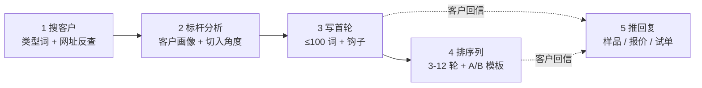

# 00 · 工作流总览

外贸主动开发到拿到询盘的完整链路 · 5 段,缺一不可。

## 各段 skill 触发线

| 段 | 用户语言信号 | 触发的 reference |
|---|---|---|
| 1 | "找客户" / "搜外贸客户" / "我做 X,找谁卖" | `01-customer-search.md` |
| 2 | "分析这家客户" / "评估这个潜在客户" / 给了一个客户网址 | `03-benchmark-analysis.md` |
| 3 | "写一封开发信" / "写第一封冷邮件" | `05-first-round-rules.md` + `04-email-sequence-rules.md` |
| 4 | "写一整套跟进序列" / "写 N 轮邮件" | `04-email-sequence-rules.md` + `08-prompt-chain.md` |
| 5 | "客户回复了" / "怎么报价" / "样品费怎么谈" | `06-reply-playbook.md` |

## 5 段之间的数据流

- 段 1 输出 **客户类型词池** + **标杆客户网址** → 段 2 输入
- 段 2 输出 **客户画像 + 切角** → 段 3 输入
- 段 3 输出 **首轮定稿** → 段 4 复用作为序列锚点
- 段 4 输出 **N 轮 × M 模板** → 用户录入来发信
- 段 5 独立触发:客户回信即进入

## 用户最常踩的 3 个坑

1. **跳过段 2 直接写邮件** → 邮件像群发模板,没有切角,回复率低
2. **段 4 让 AI 一次生成 30+ 封** → 模板趋同 / 模型偷懒省略 / 用户也消化不动
3. **段 5 当成段 3 处理** → 拿首轮 prompt 写回复,完全不对路

## 相关产品流程

来发信的产品主线(对应段 1+4):

1. AI 数据库搜客户 → AI 评分 60+ → 打标签保存 → 智能跟进计划 → 报告复盘

权威源:[laifa.xin/zhinan/quick-start-laifaxin-10min](https://www.laifa.xin/zhinan/quick-start-laifaxin-10min)
